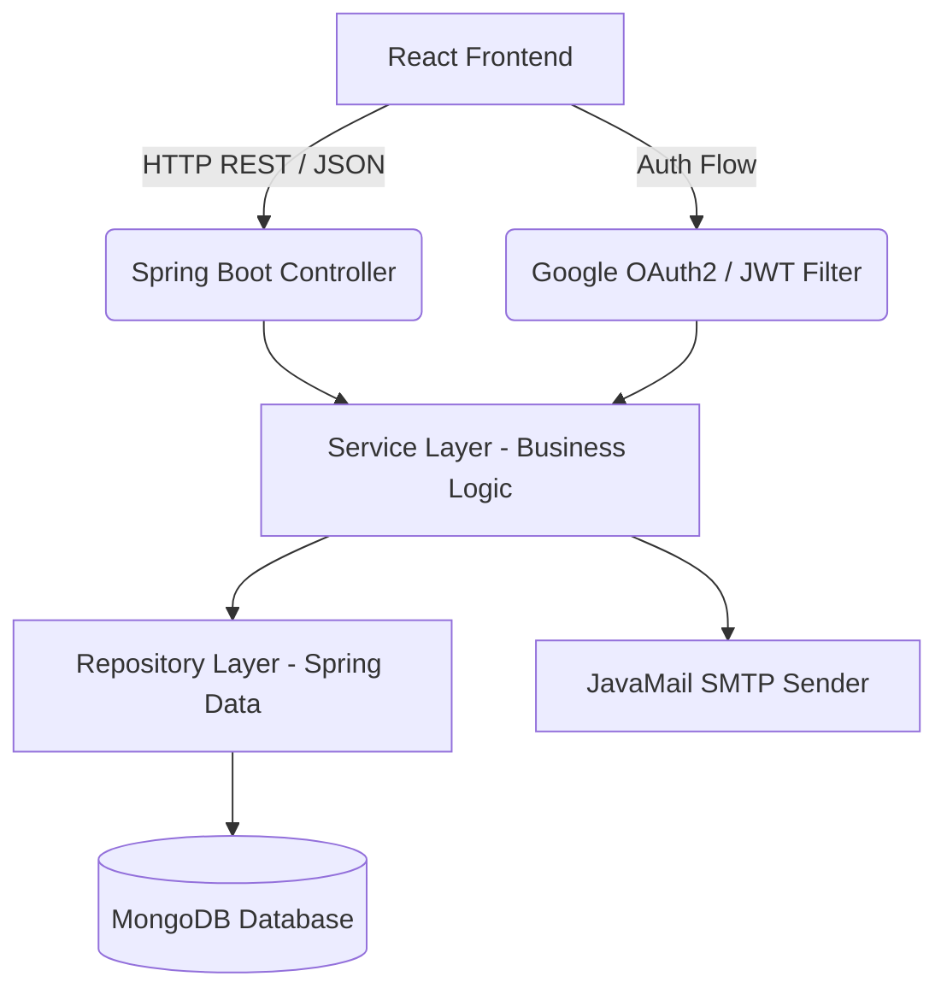
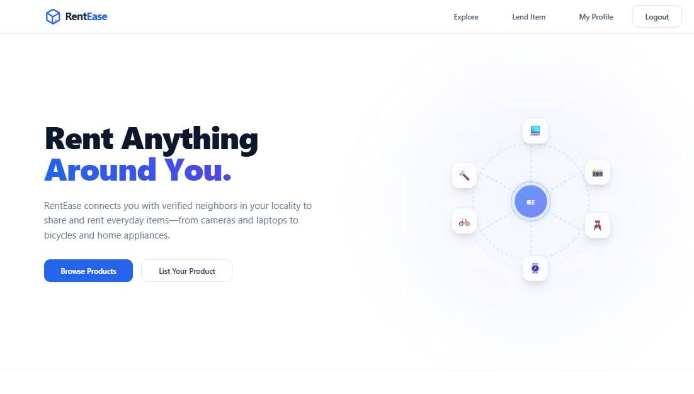
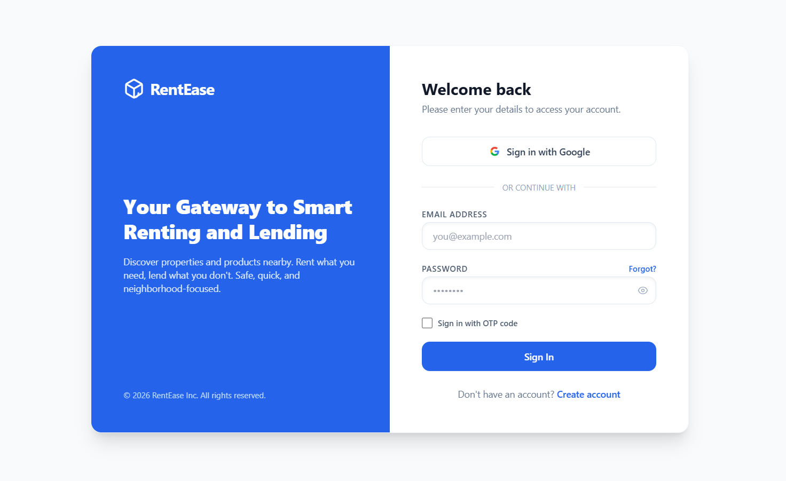
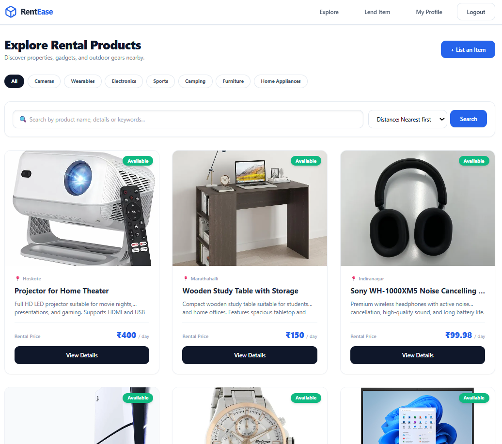
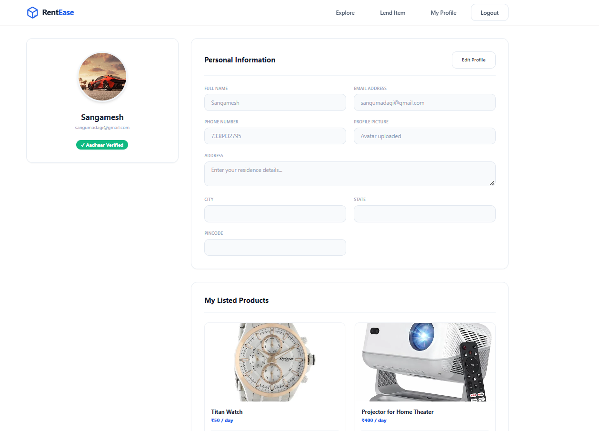
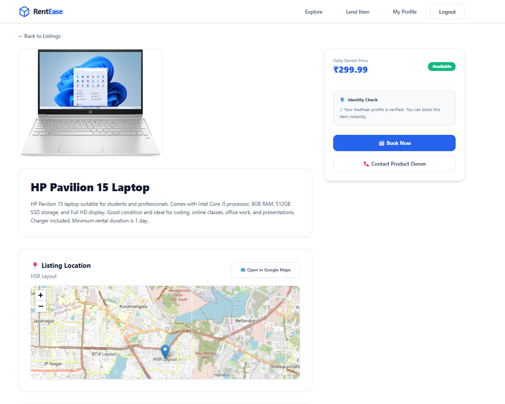
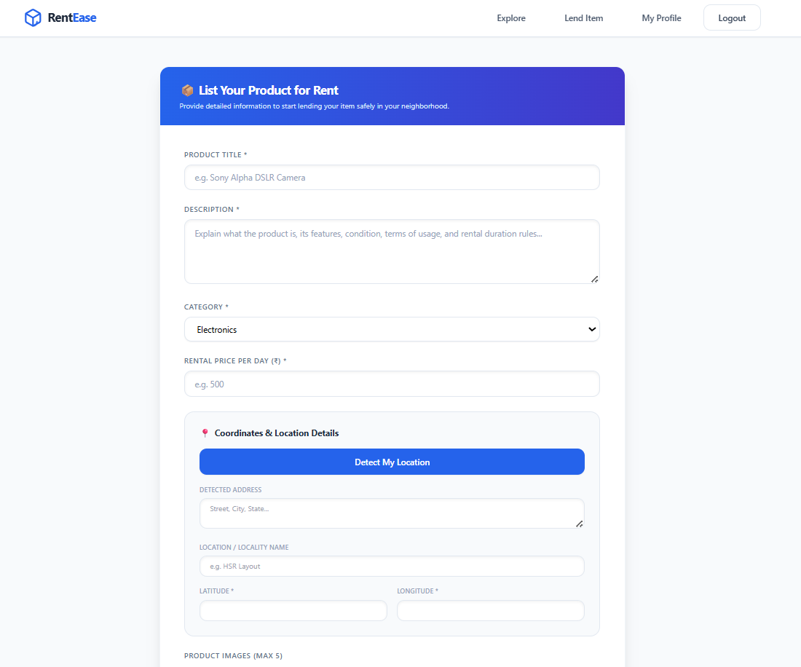

<h1 align="center">
  
  RentEase
</h1>
<p align="center">A modern full-stack rental marketplace built with Spring Boot and React.</p>

[](https://spring.io/projects/spring-boot)
[](https://react.dev/)
[](https://vitejs.dev/)
[](https://www.mongodb.com/)

---

## Project Overview

RentEase is a modern, portfolio-quality, full-stack peer-to-peer (P2P) property and asset rental platform. It enables users to dynamically browse, list, rent, book, and review properties and physical goods. Designed with decoupled frontend-backend architectures, strict security protocols, and visual excellence, RentEase serves as a production-ready showcase of a web application built using Spring Boot and React.

---

## Features

### 🔐 Authentication & Security
- **Secure JWT Authentication:** Token-based login/logout system with automatic session monitoring and client-side inactivity timeouts.
- **Social Sign-In:** Integration with **Google OAuth2** for seamless, single-click authentication.
- **Two-Factor OTP Security:** One-Time Password verification for registration, password reset, and sensitive actions sent via Spring Mail.

### 🏠 Listing & Booking Engine
- **Item Management:** Robust CRUD actions for property and asset listings, including coordinate specification and metadata.
- **Dynamic Search & Filtering:** Distance-based location sorting using the **Haversine formula**, categories, and keyword searching.
- **Interactive Maps:** Geospatial rendering with **Leaflet Maps**, displaying product locations dynamically on the UI.
- **Bookings & Reviews:** Seamless end-to-end P2P renting workflow complete with five-star rating systems and feedback submissions.

### 🛡️ Identity & Payments
- **Aadhaar Verification:** A simulated verification workflow created for demonstration purposes only. It does not connect with any official Aadhaar database, UIDAI services, government APIs, or perform real identity verification.
- **Demo Payment Environment:** A simulated payment checkout flow created to demonstrate payment workflow and transaction handling. No real payment gateway integration or real monetary transactions are involved.

---

## Tech Stack

| Layer | Technologies Used | Description |
|---|---|---|
| **Frontend** | React 18, Vite 5, TailwindCSS, PostCSS, React Router v6 | Single Page Application with optimized sub-second hot-reloads and modular designs. |
| **Backend** | Spring Boot 3.x, Spring Security, Spring Data MongoDB | Secure REST API backend managing data persistence and security filters. |
| **Database** | MongoDB Atlas / Local MongoDB | NoSQL document-based database for dynamic schemas (products, users, bookings). |
| **Security** | Spring Security OAuth2 Client, JJWT, BCrypt | Secure passwords, OAuth2 flows, and stateless JWT-based authorization. |
| **Mailing** | Spring Boot Starter Mail, JavaMail | SMTP mail client configuration for OTP deliveries. |
| **API Docs** | Springdoc OpenAPI, Swagger UI | Automatically generated Swagger endpoints spec. |

---

## Architecture

RentEase follows a decoupled, clean-architecture design. The frontend client communicates with the backend REST API over HTTPS, and the backend delegates work through controller, service, and repository layers, persisted in a MongoDB cluster.



---

## Screenshots

Here is a look at the RentEase user interface:

### Landing Page


### Login Page


### Explore Dashboard


### Profile Page


### Product Details


### Add Product Page


---

## Installation

### Prerequisites
- **Node.js** (v18.0.0 or higher)
- **Java JDK** (v17 or higher)
- **Maven** (v3.8 or higher)
- **MongoDB** (Local instance running on `27017` or a MongoDB Atlas Cloud URI)

### MongoDB Atlas Setup
1. Sign in to [MongoDB Atlas](https://www.mongodb.com/cloud/atlas).
2. Create a new shared cluster (free tier).
3. Under **Database Access**, create a user with read/write privileges.
4. Under **Network Access**, whitelist your IP address (or `0.0.0.0/0` for public testing).
5. In **Clusters** -> **Connect**, select **Drivers** and copy your Connection String (URI). Use this connection string in your `.env` configuration.

---

## Environment Variables

Copy `.env.example` templates to `.env` / `.env.local` files:

### Backend Environment Variables (`backend/.env`)
Create a `.env` file inside the `backend/` directory:
```env
PORT=8080
MONGODB_URI=mongodb+srv://<username>:<password>@cluster0.mongodb.net/rentease?retryWrites=true&w=majority
MONGODB_DATABASE=rentease

# Email Config (Gmail App Password)
MAIL_HOST=smtp.gmail.com
MAIL_PORT=587
MAIL_USERNAME=your_email@gmail.com
MAIL_PASSWORD=your_app_specific_password

# OAuth2 Google Client ID & Secret
GOOGLE_CLIENT_ID=your_google_client_id.apps.googleusercontent.com
GOOGLE_CLIENT_SECRET=your_google_client_secret

# Security Configs
SECRET_KEY=your_base64_encoded_jwt_secret_key_at_least_256_bits_long
FRONTEND_URL=http://localhost:3000
```

### Frontend Environment Variables (`frontend/.env.local`)
Create a `.env.local` file inside the `frontend/` directory:
```env
VITE_API_BASE_URL=http://localhost:8080
```

---

## Running Backend

1. Navigate to the `backend` directory:
   ```bash
   cd backend
   ```
2. Build the application and package the JAR:
   ```bash
   mvn clean package -DskipTests
   ```
3. Run the Spring Boot application:
   ```bash
   mvn spring-boot:run
   ```
   *The backend server will launch on [http://localhost:8080](http://localhost:8080)*

---

## Running Frontend

1. Navigate to the `frontend` directory:
   ```bash
   cd frontend
   ```
2. Install the node packages:
   ```bash
   npm install
   ```
3. Run the development server:
   ```bash
   npm run dev
   ```
   *The frontend client will start, typically accessible at [http://localhost:3000](http://localhost:3000)*

---

## Folder Structure

### Frontend Structure (`/frontend`)
```text
frontend/
 ├── public/          # Static public assets (favicon, logos, manifest)
 └── src/
      ├── components/ # Reusable UI components (Navbar, Button, Logo, MapView)
      │    └── Auth/  # Authentication components
      ├── context/    # Global states (AuthContext, ProductContext)
      ├── pages/      # Route pages (Home, Login, Register, Profile, ProductDetails, etc.)
      ├── services/   # REST API callers (api.js, authService.js)
      ├── utils/      # Utility helpers (session.js for token & inactivity checks)
      ├── App.jsx     # Root application component & Activity Tracker
      └── main.jsx    # Entry point
```

### Backend Structure (`/backend`)
```text
backend/
 └── src/main/java/com/rentease/
      ├── config/     # SecurityConfig, OpenApiConfig
      ├── controller/ # REST Endpoints (Auth, Booking, Product, Review, Profile)
      ├── dto/        # Data Transfer Objects (LoginRequest, JwtResponse, RegisterRequest)
      ├── exception/  # GlobalExceptionHandler and custom exceptions
      ├── model/      # MongoDB documents (User, Product, Booking, Review, Otp)
      ├── repository/ # MongoRepositories
      ├── security/   # JWT Filters, OAuth Success/Failure Handlers, Custom UserDetailsService
      └── service/    # Business services (UserService, ProductService, OtpService, EmailService)
```

---

## Future Improvements
- [ ] **AWS S3 Image Uploads:** Migrate local resource uploads to AWS S3 buckets.
- [ ] **Stripe / Razorpay Payment Integration:** Integrate real credit card checkouts.
- [ ] **WebSockets Notification System:** Send real-time booking updates and messages.
- [ ] **Advanced Matching Engine:** Recommend nearby products using collaborative filtering.

---

## Author
**Sangamesh Gangadhar Madagi**
- GitHub: [@SanguMadagi](https://github.com/SanguMadagi)
- LinkedIn: [Sangamesh Madagi](https://www.linkedin.com/in/sangamesh-madagi-a5b51a311/)
